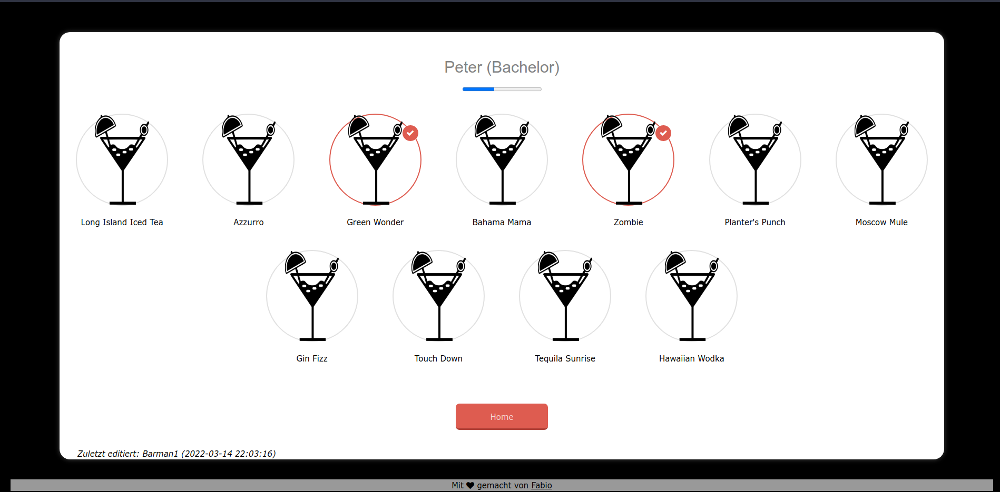

# Karlsruhe Cocktail Bachelor und Master server
This is a simple web server used in a shady Karlsruhe bar.

The idea is simple: customers can challenge themselves to a bachelor or a master cocktail diploma. Those imply drinking either a certain number of cocktails, 5 and 8 by default (this can be configured in `TYPES` in `karl_drink.py`). Anyone working behind the bar can connect to the server, add the customer, and have an overview of all current customers.
Whenever a customer feels like taking a drink, the barman can select the customer on the interface and select the drink.
Customers can access a list of most popular drinks.

The code it's fairly messy, but it (should) work.

Enjoy.

## Usage
This web server is based on Flask.

To set it up, checkout the [Flask documentation](https://flask.palletsprojects.com/en/2.0.x/tutorial/deploy/).

Passwords for users and admin should be set in `karl_drink.py` (`USER_PASSWORD`, `ADMIN_PASSWORD`).
If you want to clean up things, ideally these passwords should go to a config file.

## Overview
Here are some screenshots of the web server:

## Data structure
Users are saved in `/static/users.json` and drinks in `/static/drinks.json`.

All drinks must have a `name` and `img` attribute (image is the name of the file located in `static` folder).

All users must have `name` (string), `completed` (boolean), `ordered_drinks` (list of integers), `type` (string 'Bachelor' or 'Master'), `last_edit` (string) and `last_edit_date` (string).
## License
Do whatever you want with this. It'd be nice if you can credit me.